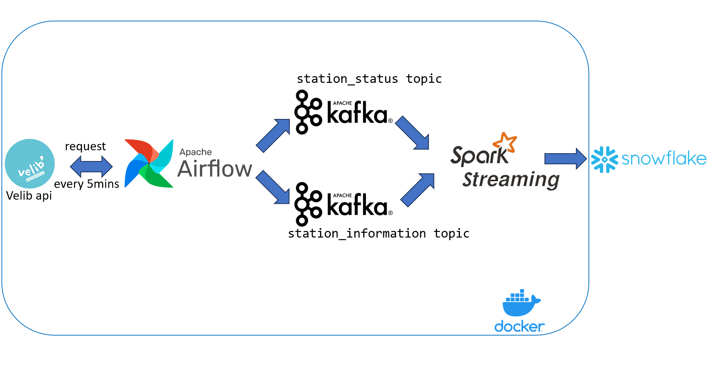

# Streaming-ETL-Pipeline

## Overview

In this personal project, I've been exploring the fantastic world of data streaming and orchestration. The goal of this project is to experiment and learn Apache Spark Streaming, Apache Kafka, Apache Airflow, and Docker to create a real-time data processing pipeline.

Velib is a bike-sharing system that allows users to rent bicycles from various stations located throughout the city of Paris.The API provides access to data and functionalities related to the Velib bike-sharing service, enabling them to integrate Velib services into their own applications or websites.

## Project Pipeline

## Technologies Used

- **Apache Spark Streaming:** For processing real-time data streams with lightning speed.

- **Apache Kafka:** To build a robust and flexible messaging system for handling data flow.

- **Apache Airflow:** To schedule and manage the data workflows.

- **Docker:** For containerizing different components and avoid the hassle of installing !

## Setup

//TODO
Install docker andd docker-compose
Create a config.yaml file based on config-template in Spark/spark-apps to configure the snowflake connection
## Usage
//TODO
docker compose up -d
docker exec -it spark-master pip install -r /bitnami/python/requirements.txt                                         
docker exec -it spark-master spark-submit --master spark://spark:7077 --deploy-mode client  --packages org.apache.spark:spark-sql-kafka-0-10_2.12:3.1.1,net.snowflake:snowflake-jdbc:3.13.22,net.snowflake:spark-snowflake_2.12:2.11.0-spark_3.3 /opt/spark-apps/transform.py

## Improvements :
//TODO
-Plug BI tool on snowflake
-Spark streaming join performance check && Watermarks 